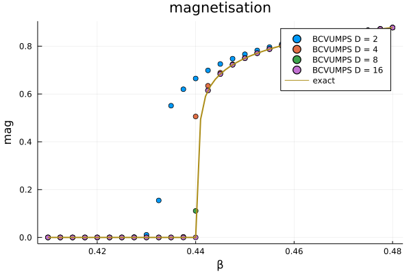
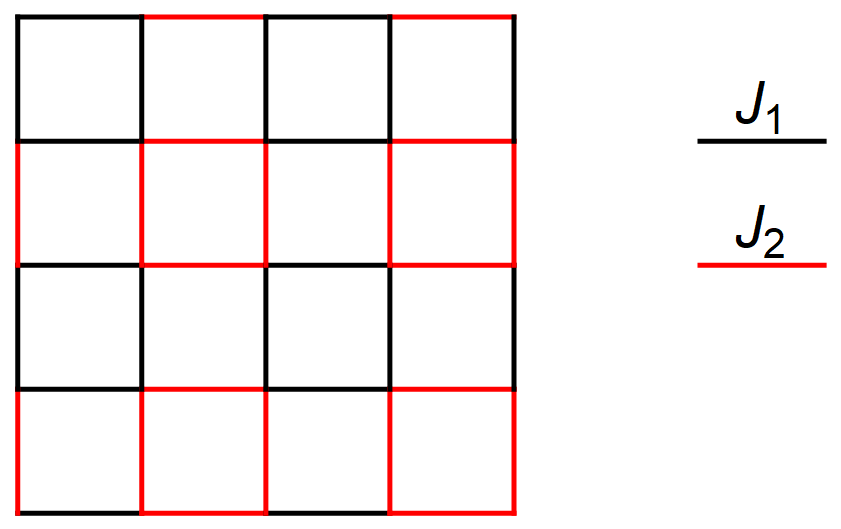
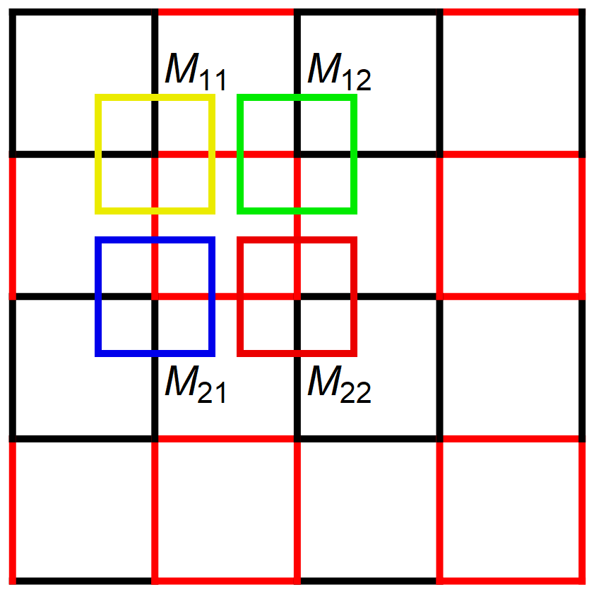
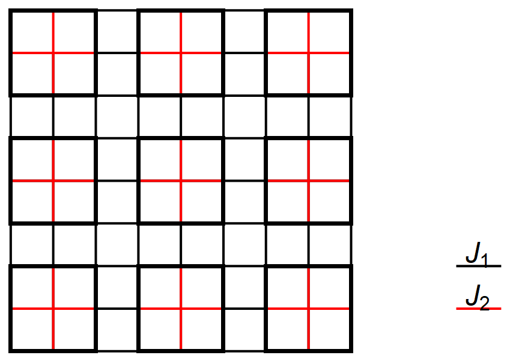
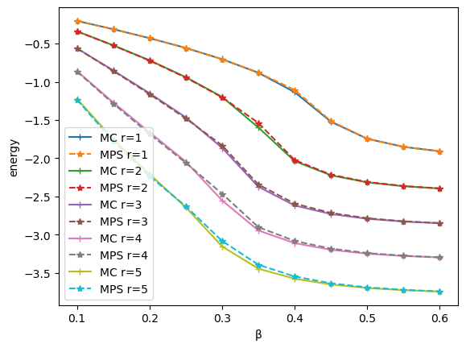

# BCVUMPS.jl

[](https://travis-ci.com/XingyuZhang2018/BCVUMPS.jl)
[](https://codecov.io/gh/XingyuZhang2018/BCVUMPS.jl)

This is a julia package to realise Big Cell(BC) for Variational Uniform Matrix product states(VUMPS). 

In this package we implemented the algorithms described in [non-trivial-VUMPS](https://arxiv.org/abs/2003.01142).

## install
```shell
> git clone https://github.com/XingyuZhang2018/BCVUMPS.jl
```
move to the file and run `julia REPL`, press `]` into `Pkg REPL`
```julia
(@v1.6) pkg> activate .
Activating environment at `..\BCVUMPS\Project.toml`

(BCVUMPS) pkg> instantiate
```
To get back to the Julia REPL, press `backspace` or `ctrl+C`. Then Precompile `BCVUMPS`
```julia
julia> using BCVUMPS
[ Info: Precompiling BCVUMPS [284ebded-cb5f-402a-b9c8-b6a334229127]
```
## Example
If you want to learn deeply into this package, I highly recommend to run each single test in `/test/runtests` in sequence.

### 2D Classical Ising Model
Although it's not necessity to using big cell to calculate 2d classical ferromagnetic ising model because its configuration is trivial, it's a good test and be familiar with the program.

We start by constructing the tensor for the tensor network representation of the 2d classical Ising Model.
This tensor can be constructed using the `model_tensor`-function that takes a `model`-parameter - in our case `Ising()` - and an inverse temperature `β` (e.g. at `β=0.5`). `Ising(Ni,Nj)` means copy the ising tensor to a `Ni ×Nj` big cell. (e.g. `Ising(2,2)`)
```julia
julia> M = model_tensor(Ising(2,2), 0.5);

julia> size(M)
(2, 2)
```
Then get BCVUMPS environment using the `bcvumps_env`-function that takes a `model`-parameter (in our case `Ising(2,2)`), an inverse temperature `β` (e.g. at `β=0.5`) and environment tenosr non-physical index dimension `D` (e.g. `D=2`)
```julia
julia> env = bcvumps_env(Ising(2,2),0.5,2; verbose = true);
random initial bcvumps 2×2 environment-> bcvumps done@step: 17, error=2.5299146055872387e-11

julia> typeof(env)
SquareBCVUMPSRuntime{Float64, Matrix{Array}, Matrix{Array}} (alias for BCVUMPSRuntime{SquareLattice, Float64, 4, Array{Array, 2}, Array{Array, 2}})
```
Then we can use these environment to calculate observable. And compare the analytical result using `magofβ`-function.
```julia
julia> magnetisation(env,Ising(2,2),0.5)
0.9115157109690473

julia> magofβ(Ising(2,2),0.5)
0.911319377877496
```
more result is ploted by `/plot/ising.jl`
<div align="center"></div>

### 2×2 J1-J2 ising model
Then We consider a more complex model which need to use big cell. The configuration shows below:
 <div align="center"></div>

 The black line and red line means different coupling. So The cell is `2×2`:
  <div align="center"></div>

Just like before, we can get BCVUMPS environment using `bcvumps_env`-function, and the model is `ising22(r)`, where the parameter `r=J1/J2`. (e.g. `Ising22(2)`)
```julia
julia> M = model_tensor(Ising22(2), 0.35);

julia> size(M)
(2,2)

julia> env = bcvumps_env(Ising22(2.0),0.35,2; verbose = true);
bcvumps 2×2 environment load from ./data/Ising22(2, 2, 2)_β0.35_D2.jld2 -> bcvumps done@step: 20, error=4.866624267867332e-11

julia> magnetisation(env,Ising22(2),0.35)
0.8983102051668891

julia> energy(env,Ising22(2),0.35)
-2.6443857232112182
```
We can compare this result with MCMC by `MCMC`-function.
```
julia> mag22,energy22 = MCMC(Ising22(2),12,0.35,10000,100000)
(0.8978019444444444, -2.643381111111111)
```
more result is ploted by `/plot/ising22.jl`
<div align="center"></div>

# To do
## 3x3 Ising model example
Black bonds mean weak connects J1
Red bonds mean weak connects J2



Compare the results with MC


